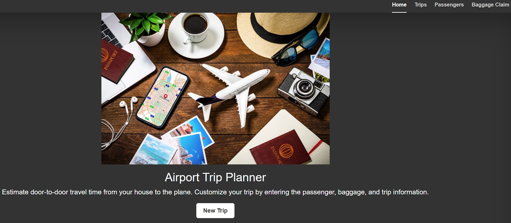

<!-- PROJECT SHIELDS -->
<!--
*** I'm using markdown "reference style" links for readability.
*** Reference links are enclosed in brackets [ ] instead of parentheses ( ).
*** See the bottom of this document for the declaration of the reference variables
*** for contributors-url, forks-url, etc. This is an optional, concise syntax you may use.
*** https://www.markdownguide.org/basic-syntax/#reference-style-links
-->

[![LinkedIn][linkedin-shield]][linkedin-url]


<!-- PROJECT LOGO -->
<br />
<div align="center">
  <a href="https://git.heroku.com/airport-buddy.git">
    
  </a>

  <h3 align="center">Airport Buddy</h3>

  <p align="center">
    An awesome Trip management APP for your commute to the airport! Airport Buddy!
    <br />
    <a href="https://github.com/jondawson917/capstone-1/readme.md"><strong>Explore the docs »</strong></a>
    <br />
    <br />
    <a href="mailto:jondawson917@gmail.com">Report Bug</a>
    ·
    <a href="mailto:jondawson917@gmail.com">Request Feature</a>
  </p>
</div>


<!-- TABLE OF CONTENTS -->
<details>
  <summary>Table of Contents</summary>
  <ol>
    <li>
      <a href="#about-the-project">About The Project</a>
      <ul>
        <li><a href="#built-with">Built With</a></li>
      </ul>
    </li>
    <li>
      <a href="#getting-started">Getting Started</a>
      <ul>
        <li><a href="#prerequisites">Prerequisites</a></li>
        <li><a href="#installation">Installation</a></li>
        <li><a href="#Usage">Usage</a></li>
        <li><a href="#Contact">Contact</a></li>
      </ul>
    </li>
  </ol>
</details>


<!-- ABOUT THE PROJECT -->
## About The Project

[![Airport Buddy][product-screenshot]](https://git.heroku.com/airport-buddy.git)

Airport Buddy provides a trip management tool for group to plan their trip to the airport. 
Travelers can manage create, edit, and remove trip-info while viewing security wait times and commute-time to the airport.

Here's why:
* Your time should be focused on holding your bags and navigating to the airport, not fumbling through emails and texts for trip info
* Your time is valuable 
* Your urgency shouldn't be an emergency! :smile: 


<p align="right">(<a href="#readme-top">back to top</a>)</p>


### Built With

Built with the following frameworks:

* [![Python][Python-shield]][Python-url]
* [![Flask][Flask-shield]][Flask-url]
* [![SQLAlchemy][SQLAlchemy-shield]][SqlAlchemy-url]
* [![PostgreSQL][Postgres-shield]][Postgres-url]
* [![WTForms][WTForms-shield]][WTForms-url]
* [![Bootstrap][Bootstrap.com]][Bootstrap-url]
* [![JQuery][JQuery.com]][JQuery-url]
* [![HTML5][HTML-shield]][HTML-url]

<p align="right">(<a href="#readme-top">back to top</a>)</p>


<!-- GETTING STARTED -->
## Getting Started

A few steps to install the packages and set the API key

### Prerequisites

pip3 install requirements.txt

(Required) TSA_API_KEY - included in API_DATA.py
           BING_API_KEY - included in API_DATA.py


### Installation

_Below is an example of how you can instruct your audience on installing and setting up your app. This template doesn't rely on any external dependencies or services._

1. Get a free TSA API Key at [https://www.tsawaittimes.com/api](https://www.tsawaittimes.com/api) (7 DAY EXPIRATION)
2. Get a free TSA API Key at [https://www.microsoft.com/en-us/maps/choose-your-bing-maps-api](https://www.microsoft.com/en-us/maps/choose-your-bing-maps-api) (NO EXPIRATION - YOU MAY USE INCLUDED API KEY)
3. Clone the repo
   ```sh
   git clone https://github.com/jondawson917/capstone-1.git
   ```
3. Install required packages
   ```sh
   pip3 install requirements.txt
   ```
4. Enter your API KEY (if expired) in `API_DATA.py`
   ```js
   const TSA_API_KEY = 'ENTER YOUR API';
   const BING_API_KEY = 'ENTER YOUR API';
   ```

<p align="right">(<a href="#readme-top">back to top</a>)</p>


<!-- USAGE EXAMPLES -->
## Usage

#### Watch the Demo!

[](https://www.youtube.com/embed/G0MnTOLshXE)

<p align="right">(<a href="#readme-top">back to top</a>)</p>


<!-- CONTACT -->
## Contact

Your Name - [@jondawson917](https://twitter.com/jondawson917) - jondawson917@gmail.com

Project Link: [![Heroku][heroku-shield]][project-url]

<p align="right">(<a href="#readme-top">back to top</a>)</p>


<!-- LINKS & IMAGES -->
[contributors-shield]: https://img.shields.io/github/contributors/othneildrew/Best-README-Template.svg?style=for-the-badge
[contributors-url]: https://github.com/othneildrew/Best-README-Template/graphs/contributors
[forks-shield]: https://img.shields.io/github/forks/othneildrew/Best-README-Template.svg?style=for-the-badge
[forks-url]: https://github.com/othneildrew/Best-README-Template/network/members
[stars-shield]: https://img.shields.io/github/stars/othneildrew/Best-README-Template.svg?style=for-the-badge
[stars-url]: https://github.com/othneildrew/Best-README-Template/stargazers
[issues-shield]: https://img.shields.io/github/issues/othneildrew/Best-README-Template.svg?style=for-the-badge
[issues-url]: https://github.com/othneildrew/Best-README-Template/issues
[license-shield]: https://img.shields.io/github/license/othneildrew/Best-README-Template.svg?style=for-the-badge
[license-url]: https://github.com/othneildrew/Best-README-Template/blob/master/LICENSE.txt
[linkedin-shield]: https://img.shields.io/badge/-LinkedIn-black.svg?style=for-the-badge&logo=linkedin&colorB=555
[linkedin-url]: https://linkedin.com/in/jondawson917
[product-screenshot]: images/Airport_Buddy.jpg
[Bootstrap.com]: https://img.shields.io/badge/Bootstrap-563D7C?style=for-the-badge&logo=bootstrap&logoColor=white
[Bootstrap-url]: https://getbootstrap.com
[JQuery.com]: https://img.shields.io/badge/jQuery-0769AD?style=for-the-badge&logo=jquery&logoColor=white
[JQuery-url]: https://jquery.com
[HTML-url]: https://developer.mozilla.org/en-US/docs/Glossary/HTML5
[Flask-shield]: https://img.shields.io/badge/flask-%23000.svg?style=for-the-badge&logo=flask&logoColor=white
[Python-shield]: https://img.shields.io/badge/python-3670A0?style=for-the-badge&logo=python&logoColor=ffdd54
[Postgres-shield]: https://img.shields.io/badge/postgres-%23316192.svg?style=for-the-badge&logo=postgresql&logoColor=white
[HTML-shield]: https://img.shields.io/badge/HTML-239120?style=for-the-badge&logo=html5&logoColor=white
[SQLAlchemy-shield]: https://img.shields.io/badge/-SqlAlchemy-orange
[WTForms-shield]: https://img.shields.io/badge/-WTForms-lightgrey
[Heroku-shield]: https://img.shields.io/badge/heroku-%23430098.svg?style=for-the-badge&logo=heroku&logoColor=white
[project-url]: https://airport-buddy.herokuapp.com/
[Python-url]: https://python.org
[WTForms-url]: https://github.com/wtforms/wtforms
[Flask-url]: https://flask.palletsprojects.com/
[SQLAlchemy-url]: https://www.sqlalchemy.org/
[Postgres-url]: https://www.postgresql.org/
[video-url]: https://www.youtube.com/watch?v=G0MnTOLshXE
